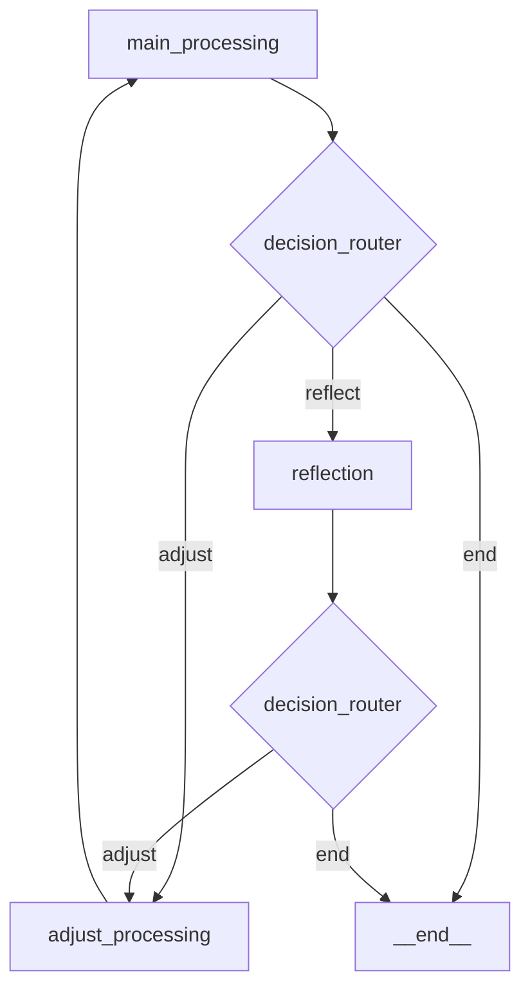

# Template Cookiecutter para Micro-Agentes Python

Um template Cookiecutter robusto para criar micro-agentes Python especializados usando Clean Architecture, FastAPI, LangGraph, LangChain e OpenAI, otimizado para integração com Kestra.

## 🌟 Características Principais

- **🏗️ Clean Architecture**: Separação clara de responsabilidades em camadas
- **🤖 LangGraph**: Workflow de agentes com nós interconectados e decision routing
- **⚡ FastAPI**: API REST moderna com documentação automática
- **🔗 LangChain**: Integração nativa com LLMs e ferramentas
- **🧠 OpenAI**: Suporte para GPT-4o, GPT-4o-mini e outros modelos
- **🔄 Reflexão Automática**: Sistema de auto-avaliação e melhoria iterativa
- **📊 LangSmith**: Monitoramento e debugging opcional
- **🐳 Docker Ready**: Containerização completa com Docker e Docker Compose
- **📦 uv**: Gerenciamento de dependências ultrarrápido
- **🔌 Kestra Integration**: Pronto para integração com workflows Kestra
- **📝 Logging Estruturado**: Logs JSON com structlog
- **🛡️ Configuração Robusta**: Validação de configuração com Pydantic Settings

## 🚀 Início Rápido

### Pré-requisitos

```bash
# Python 3.12+
python --version

# Cookiecutter
pip install cookiecutter

# uv (recomendado)
pip install uv
```

### 1. Gerar Projeto

```bash
# Use o template
cookiecutter https://github.com/seu-usuario/agent-template

# Ou localmente
cookiecutter .
```

### 2. Configurar Projeto

```bash
# Entre no diretório gerado
cd meu-novo-agente

# Configure variáveis de ambiente
cp ENV_VARS.md .env
# Edite o .env com suas chaves da API

# Instale dependências
uv sync

# Execute o agente
uv run uvicorn main:app --reload
```

### 3. Testar API

```bash
# Health check
curl http://localhost:8000/health

# Documentação automática
open http://localhost:8000/docs
```

## 📁 Estrutura Gerada

```
meu-novo-agente/
├── app/
│   ├── presentation/           # 🌐 Camada de Apresentação (FastAPI)
│   │   └── domain_router.py    # Endpoints REST
│   ├── application/            # 📋 Camada de Aplicação
│   │   ├── agent/              # 🤖 Agentes LangGraph
│   │   │   └── AgentName/
│   │   │       ├── agent_builder/     # Construtor do grafo
│   │   │       └── node_functions/    # Nós do workflow
│   │   │           ├── main_node/     # Nó principal
│   │   │           ├── reflect_node/  # Nó de reflexão
│   │   │           └── adjust_node/   # Nó de ajuste
│   │   ├── interfaces/         # 🔌 Contratos/Protocolos
│   │   └── services/           # ⚙️ Serviços de aplicação
│   ├── domain/                 # 🏢 Camada de Domínio
│   │   ├── entities/           # Entidades de negócio
│   │   └── state/              # Estados do LangGraph
│   └── infrastructure/         # 🔧 Camada de Infraestrutura
│       ├── config/             # Configurações
│       └── llm/                # Serviços LLM
├── main.py                     # 🚪 Ponto de entrada
├── pyproject.toml             # 📦 Configuração do projeto
├── Dockerfile                 # 🐳 Container Docker
├── docker-compose.yml         # 🐙 Orchestração
└── README.md                  # 📖 Documentação
```

## 🎯 Workflow do Agente (LangGraph)



### Nós Implementados

1. **🎯 main_processing**: Processamento principal usando LLM
2. **🔍 reflection**: Avaliação da qualidade do resultado
3. **⚙️ adjust_processing**: Ajustes baseados na reflexão
4. **🧭 decision_router**: Roteamento inteligente entre nós

## 🛠️ Configuração Avançada

### Variáveis de Ambiente

```bash
# OpenAI (Obrigatório)
OPENAI_API_KEY=sua_chave_aqui
OPENAI_MODEL=gpt-4o-mini

# LangSmith (Opcional)
LANGCHAIN_TRACING_V2=true
LANGCHAIN_API_KEY=sua_chave_langsmith

# Configuração do Agente
AGENT_MAX_RETRIES=3
AGENT_TIMEOUT=30
AGENT_ENABLE_REFLECTION=true
```

### Personalização

#### 1. Modificar Prompts

Edite os arquivos `node.py` em cada nó para customizar os prompts:

```python
# app/application/agent/AgentName/node_functions/main_node/node.py
system_prompt = """Seu prompt customizado aqui..."""
```

#### 2. Adicionar Novos Nós

```bash
# 1. Crie o diretório do nó
mkdir app/application/agent/AgentName/node_functions/novo_node

# 2. Implemente a função do nó
# 3. Adicione no agent_builder.py
# 4. Atualize o decision_router.py
```

#### 3. Configurar Novos Endpoints

```python
# app/presentation/domain_router.py
@router.post("/novo-endpoint")
async def novo_endpoint(request: NovoRequest):
    # Implementação
```

## 🐳 Deploy

### Docker

```bash
# Build e execução
docker build -t meu-agente .
docker run -p 8000:8000 --env-file .env meu-agente
```

### Docker Compose

```bash
# Desenvolvimento
docker-compose up --build

# Produção
docker-compose -f docker-compose.yml -f docker-compose.prod.yml up -d
```

### Kubernetes

```yaml
# Exemplo de deployment
apiVersion: apps/v1
kind: Deployment
metadata:
  name: meu-agente
spec:
  replicas: 3
  selector:
    matchLabels:
      app: meu-agente
  template:
    spec:
      containers:
        - name: agent
          image: meu-agente:latest
          ports:
            - containerPort: 8000
```

## 🔗 Integração com Kestra

### Exemplo de Flow

```yaml
id: agent-workflow
namespace: ai.agents

tasks:
  - id: process-content
    type: io.kestra.plugin.core.http.Request
    uri: http://meu-agente:8000/domain/process
    method: POST
    body: |
      {
        "content": "{{ inputs.content }}",
        "options": {"enable_reflection": true}
      }
```

## 📊 Monitoramento

### Métricas Incluídas

- ⏱️ Tempo de execução por nó
- 🎯 Taxa de sucesso/erro
- 💰 Uso de tokens OpenAI
- 📈 Scores de confiança
- 🔄 Número de iterações

### Health Checks

```bash
# Status da aplicação
curl http://localhost:8000/health

# Status específico do agente
curl http://localhost:8000/domain/health

# Schema do workflow
curl http://localhost:8000/domain/schema
```

## 🧪 Testes

### Teste Automatizado

```bash
# Execute o script de teste
python test_template.py
```

### Testes Manuais

```bash
# Teste básico
curl -X POST http://localhost:8000/domain/process \
  -H "Content-Type: application/json" \
  -d '{"content": "texto para processar"}'

# Teste com reflexão
curl -X POST http://localhost:8000/domain/process-with-reflection \
  -H "Content-Type: application/json" \
  -d '{"content": "texto complexo", "options": {"enable_reflection": true}}'
```

## 📚 Exemplos Práticos

- **[Análise de Sentimentos](EXEMPLO_USO.md)**: Agente especializado em análise de sentimentos
- **Sumarização**: Agente para sumarização de textos
- **Classificação**: Agente para classificação de documentos
- **Extração de Entidades**: Agente para NER (Named Entity Recognition)

## 🛡️ Boas Práticas

### Segurança

- ✅ Nunca commitar chaves de API
- ✅ Usar variáveis de ambiente para configuração
- ✅ Implementar rate limiting em produção
- ✅ Validar entrada rigorosamente

### Performance

- ✅ Configurar timeouts apropriados
- ✅ Implementar cache quando necessário
- ✅ Monitorar uso de tokens
- ✅ Usar modelos apropriados (GPT-4o-mini para tarefas simples)

### Desenvolvimento

- ✅ Seguir Clean Architecture
- ✅ Implementar testes unitários
- ✅ Usar logging estruturado
- ✅ Documentar APIs com FastAPI

## 🤝 Contribuição

1. Fork o projeto
2. Crie uma branch para sua feature (`git checkout -b feature/AmazingFeature`)
3. Commit suas mudanças (`git commit -m 'Add some AmazingFeature'`)
4. Push para a branch (`git push origin feature/AmazingFeature`)
5. Abra um Pull Request

## 📄 Licença

Este projeto está licenciado sob a Licença MIT - veja o arquivo [LICENSE](LICENSE) para detalhes.

## 🆘 Suporte

- 📖 [Documentação Completa](COMO_USAR_TEMPLATE.md)
- 💡 [Exemplo Prático](EXEMPLO_USO.md)
- 🧪 [Scripts de Teste](test_template.py)
- 🐛 [Reportar Issues](https://github.com/seu-usuario/agent-template/issues)

## 🗺️ Roadmap

- [ ] Suporte a múltiplos LLM providers (Anthropic, Google, etc.)
- [ ] Templates especializados por domínio
- [ ] Dashboard de monitoramento integrado
- [ ] Suporte a streaming de respostas
- [ ] Integração com bancos vetoriais
- [ ] Ferramentas de debugging visuais
- [ ] CI/CD templates

---

**Criado com ❤️ para acelerar o desenvolvimento de micro-agentes Python de alta qualidade.**
